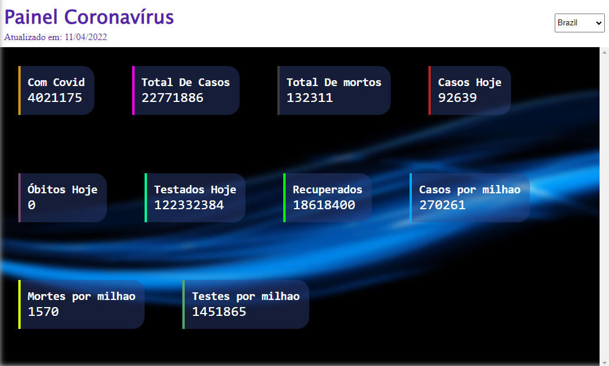

# Covid Monitor

Neste Projeto você consegue monitorar os casos de covid 19 do dia atual em certos paises.

Projeto simples seguindo instruções do bootcamp Web Developer Carrefour.

## Tecnologias utilizadas:
* ReactJS
* Api Rest
* Css Modules
* Sass

## Executar:

* `cd covid-monitor` 
* `yarn start`

## OBS:
Não tome nenhum fato descrito neste aplicativo como fonte verdadeira de informação, estes dados não são apurados e nem verificados, caso precise de informações sobre a covid19 em seu pais recomendo utilizar o site do governo `https://covid.saude.gov.br/`
